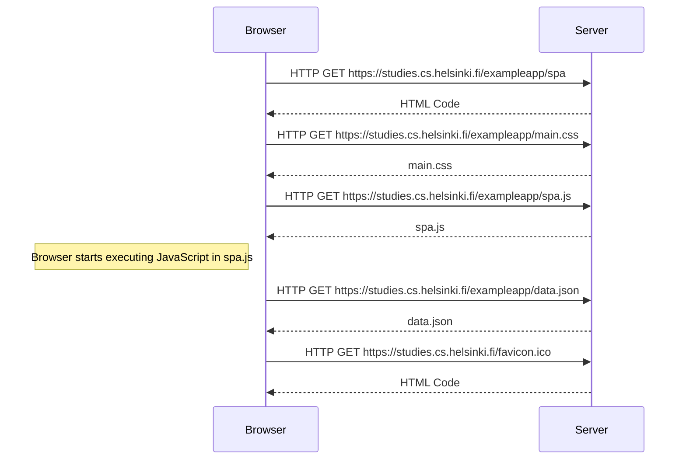

```mermaid
sequenceDiagram
    participant Browser
    participant Server
    Browser->>Server: HTTP GET https://studies.cs.helsinki.fi/exampleapp/spa
    Server-->>Browser: HTML Code
    Browser->>Server: HTTP GET https://studies.cs.helsinki.fi/exampleapp/main.css
    Server-->>Browser: main.css
    Browser->>Server: HTTP GET https://studies.cs.helsinki.fi/exampleapp/spa.js
    Server-->>Browser: spa.js
    Note left of Browser: Browser starts executing JavaScript in spa.js
    Browser->>Server: HTTP GET https://studies.cs.helsinki.fi/exampleapp/data.json
    Server-->>Browser: data.json
    Browser->>Server: HTTP GET https://studies.cs.helsinki.fi/favicon.ico
    Server-->>Browser: HTML Code
```